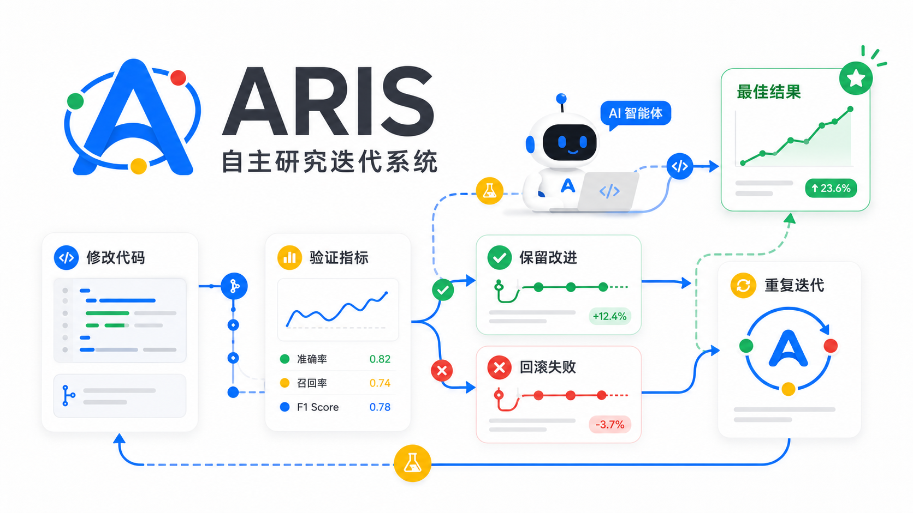

<div align="center">



# ARIS

**A Skill That Makes AI Coding Agents Iterate Autonomously**

[](LICENSE)

Copy the `skills/aris/` folder into your project, type `/aris`, and the agent enters an autonomous experiment loop — editing code, verifying metrics, keeping improvements, reverting failures — no binary installation required.

Inspired by [Karpathy's autoresearch](https://github.com/karpathy/autoresearch).

[30-Second Start](#30-second-start) · [Natural Language Tasks](#natural-language-tasks) · [Skill Commands](#skill-commands) · [Why ARIS](#why-aris) · [How It Works](#how-it-works) · [CLI (Optional)](#cli-optional)

[中文文档](README.md)

</div>

---

## What Is This?
ARIS is a **portable Skill protocol** — a few Markdown files that teach AI coding agents to optimize any measurable target through a disciplined process.


| What you do | What the agent does |
|-------------|---------------------|
| Copy `skills/aris/` into your project | Reads the protocol automatically |
| Type `/aris` + describe your goal | Enters an 8-phase autonomous loop |
| Grab coffee ☕ | Edit → Verify → Keep/Revert → Repeat |
| Review results | Outputs a structured experiment report |

**Supported agents:** Claude Code · OpenAI Codex · Cursor · Windsurf · OpenCode · Gemini CLI · GitHub Copilot · Universal `.agents/skills/` workflows

---

## 30-Second Start

**Option 1: Let your Agent install it (Recommended)**

Just give your agent (like Claude Code) a task:
> "Install aris-cli for me (you can use `cargo install aris-cli` globally, or install it locally in a way that fits this project), and then run `aris install claude-code`."

Then, simply type `/aris` in the agent to begin.

**Option 2: Manual copy (zero install)**

```bash
# Copy skill files into your project
cp -r skills/aris/ your-project/.claude/skills/aris/
cp -r commands/aris/ your-project/.claude/commands/aris/
cp commands/aris.md your-project/.claude/commands/aris.md
```

Then type `/aris` in your agent. Done.

**Option 3: Manual CLI install**

```bash
cargo install aris-cli
aris install claude-code   # or codex / cursor / windsurf / gemini / copilot / all
```

The CLI places skill files in the right location and adds `aris doctor` pre-checks, `aris watch` live dashboard, and more. But **the skill itself does not depend on the CLI**.

---

## Natural Language Tasks

No structured fields to memorize. Describe what you want like you'd tell a colleague:

```
/aris
I need to test whether my data preprocessing pipeline is fully ok.
Validate every output item using vllm. All 133 items passing is our goal.

Agent: (understands the objective, breaks down verification, iterates)
       Baseline: 98/133 passing → Final: 133/133 passing (12 keeps, 5 discards)
```

```
/aris
Get this model's inference latency under 50ms. Use wrk for benchmarking.
Don't break existing unit tests.

Agent: (infers metric as p99 latency, direction lower, guard as npm test)
       Baseline: 127ms → Best: 43ms (18 keeps, 12 discards)
```

```
/aris
My ETL script currently hangs on 17 edge cases. Fix them one by one.
cargo test all green means done.

Agent: (decomposes into 17 sub-goals, iterates through each)
       Baseline: 0/17 passing → Final: 17/17 passing (17 keeps, 9 discards)
```

You can also use structured fields for precise control:

```
/aris
Goal: Increase test coverage to 90%
Scope: src/**/*.ts
Verify: npx jest --coverage | grep 'All files' | awk '{print $4}'
Guard: npm test
Direction: higher
Iterations: 30
```

The agent automatically infers the target metric, verification command, scope, and completion criteria from your description. Just talk normally.

---

## Skill Commands

| Command | What the agent does |
|---------|---------------------|
| `/aris` | Run the autonomous experiment loop |
| `/aris:plan` | Interactive wizard: analyze codebase → suggest goals, metrics, verify commands |
| `/aris:debug` | Autonomous bug-hunting loop (scientific method: hypothesize → test → eliminate) |
| `/aris:fix` | Iteratively repair errors until zero remain |

### Don't Know What Metric to Use?

```
/aris:plan
Goal: Make the API faster
```

The plan wizard analyzes your codebase, suggests metrics, and dry-runs the verify command before launching. Let the agent figure it out.

---

## Why ARIS?

AI coding agents are good at making changes. They are less reliable at running long, disciplined optimization campaigns unless the workflow is explicit. ARIS supplies that workflow.

| Problem | ARIS behavior |
|---------|---------------|
| Agents make broad, hard-to-debug changes | One atomic change per iteration |
| "Looks better" replaces real measurement | Mechanical metric verification only |
| Failed attempts pollute the working tree | Automatic rollback through git |
| Experiment history disappears from context | Structured logs and commit history |
| Metrics get gamed after many iterations | Reward-hacking detection flags suspicious jumps |
| Different agents need different prompts | One portable skill across platforms |

---

## How It Works

### The 8-Phase Loop

```
Phase 0: Precondition  — validate environment (git repo, config, eval command)
Phase 1: Review        — read experiment history + git log (EVERY iteration)
Phase 2: Ideate        — pick ONE atomic change based on past results
Phase 3: Modify        — implement the change
Phase 4: Commit        — git commit BEFORE verify (enables clean revert)
Phase 5: Verify        — run eval, extract metric
Phase 6: Decide        — mechanical decision: keep / discard / rework / crash
Phase 7: Log           — record result
Phase 8: Loop          — back to Phase 1
```

### Decision Rules

| Condition | Action |
|-----------|--------|
| Metric improved, guard passed | **KEEP** — advance |
| Metric improved, guard failed | **REWORK** (max 2 attempts) |
| Metric same or worse | **DISCARD** — git revert |
| Eval crashed | **AUTO-FIX** (max 3 attempts) |
| No code change produced | **SKIP** |
| 15 iterations without improvement | **PLATEAU** — pause and ask |

### Core Principles

1. **One change per iteration** — atomic. If it breaks, you know why.
2. **Mechanical verification only** — no subjective judgment. Numbers only.
3. **Automatic rollback** — failed changes revert via `git revert`.
4. **Git is memory** — every experiment committed, failures visible in history.
5. **Hyperparameters first** — lowest risk, highest signal. Architecture last.
6. **Reward hacking detection** — flags implausible improvements.

---

## Adapting to Different Domains

| Domain | Metric | Verify Command | Guard |
|--------|--------|----------------|-------|
| ML training | val_loss (lower) | `python train.py \| grep val_loss` | — |
| Test coverage | coverage % (higher) | `pytest --cov \| grep TOTAL` | `pytest -x` |
| Web performance | p99 latency (lower) | `npm run bench \| grep p99` | `npm test` |
| Build speed | build time (lower) | `time cargo build` | `cargo test` |
| Code quality | lint score (higher) | `pylint src/ \| grep rated` | `pytest -x` |
| Bundle size | bytes (lower) | `esbuild --bundle --minify \| wc -c` | `npm test` |

---

## CLI (Optional)

The skill protocol handles the core loop through normal shell and git commands — **no installation needed**. The CLI adds capabilities that matter most during long runs:

```bash
cargo install aris-cli
```

### Skill vs Skill + CLI

| Skill Only (zero install) | Skill + CLI |
|---------------------------|-------------|
| ✅ Works immediately | ✅ One-command install to any agent |
| ✅ Full 8-phase loop | ✅ Full loop + structured logging |
| TSV file for experiment log | JSONL with structured schema |
| Manual metric tracking | Reward-hacking detection |
| `tail` / `sort` for history | `aris log`, `aris best`, `aris diff` |
| No pre-checks | `aris doctor` (14+ pre-flight checks) |
| No visualization | `aris watch` (live TUI dashboard) |

### Key Commands

| Command | Purpose |
|---------|---------|
| `aris init` | Initialize project config |
| `aris install <agent>` | One-command skill install for target agent |
| `aris doctor` | Pre-flight validation |
| `aris record --metric X --status Y` | Record experiment |
| `aris log` | View history |
| `aris best` | Best result + diff |
| `aris watch` | Live TUI dashboard |
| `aris fork` / `aris merge-best` | Parallel exploration |
| `aris report` | Generate summary |
| `aris export --format csv` | Export for analysis |

All commands support `--json` and `AUTORESEARCH_FORMAT=json` env var.

---

## Project Structure

```
aris-cli/
├── skills/aris/                    ← Skill protocol (the core — just copy this)
│   ├── SKILL.md                    ← Main skill index + router
│   └── references/                 ← Phase protocols
│       ├── autonomous-loop-protocol.md
│       ├── core-principles.md
│       ├── plan-workflow.md
│       ├── debug-workflow.md
│       ├── fix-workflow.md
│       └── results-logging.md
├── commands/aris/                   ← Slash command dispatchers
│   ├── plan.md
│   ├── debug.md
│   └── fix.md
├── src/                            ← Optional Rust CLI
└── tests/
```

---

## Feedback & Issues

If you encounter any bugs, have feature requests, or catch your agent doing something hilarious (reward hacking), please open an issue!

- 🐛 [Submit an Issue](https://github.com/HaiyangDiiing/aris-cli/issues)
- 💡 Pull requests are welcome for both the core skill protocol and the CLI.

---

## License

MIT — see [LICENSE](LICENSE).

---

## Credits

- [Andrej Karpathy](https://github.com/karpathy) — for the [autoresearch](https://github.com/karpathy/autoresearch) concept
- [uditgoenka/autoresearch](https://github.com/uditgoenka/autoresearch) — for the Claude Code skill framework that inspired the protocol layer
